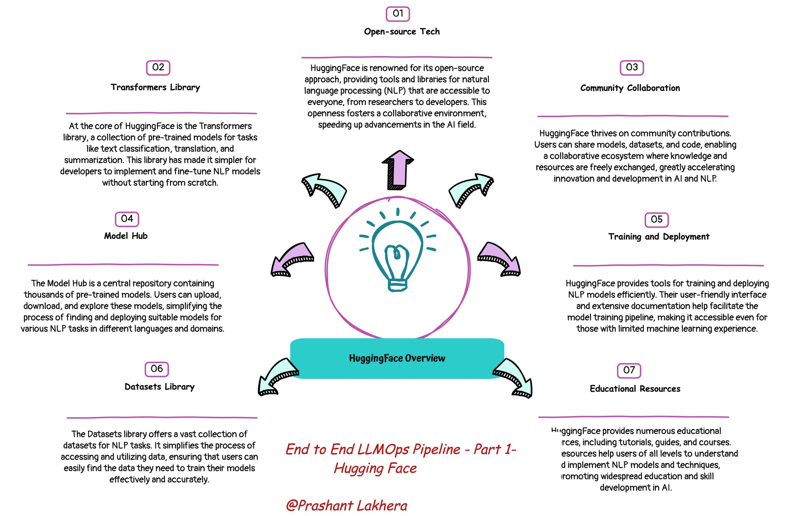

# What is Hugging Face?

Hugging Face is a leading organization in the field of Natural Language Processing (NLP), known for its open-source libraries and resources that make it easier to build and deploy state-of-the-art machine learning models. Their transformers library provides easy access to thousands of pre-trained models in a standardized format, which can be used for tasks such as text classification, text generation, named entity recognition, and question answering.

## What are Transformers?

Transformers are a type of deep learning model architecture that has revolutionized NLP. They are based on self-attention mechanisms, which allow them to consider the importance of different words in a sequence relative to each other. This architecture has proven extremely effective for tasks that require understanding context, such as translation, summarization, and question answering.

## Getting Started
Prerequisites
* Python 3.6 or higher
* transformers library by Hugging Face
* torch (PyTorch)

## Installation
You need to install the necessary libraries. You can do this using pip:
```bash
pip install transformers torch
```
> **Note:** Installing these modules manually via pip is just for demonstration purposes. We are going to create `requirements.txt` and install these modules via GitHub Action.


## Using the Question Answering Pipeline
The following code sets up a question-answering pipeline using a pre-trained model from Hugging Face's model hub.

```bash
# Initialize the Hugging Face question-answering pipeline
qa_pipeline = pipeline("question-answering", model="distilbert-base-uncased-distilled-squad")

# Define the context and question
context = """
Hugging Face is a technology company that provides open-source NLP libraries 
and creates tools for machine learning developers. The company is widely 
recognized for its transformers library, which offers pre-trained models 
for a variety of NLP tasks.
"""

question = "What does Hugging Face provide?"

# Get the answer
answer = qa_pipeline(question=question, context=context)

# Display the result
print(f"Question: {question}")
print(f"Answer: {answer['answer']}")
```

> **Note:** This code is for demonstration purposes; we will use it along with FastAPI.

## Example Output
When you run the above code, you should see output similar to:

```bash
Question: What does Hugging Face provide?
Answer: open-source NLP libraries
```

## Explanation
The code demonstrates how to use the Hugging Face transformers library to create a question-answering pipeline. It imports the pipeline function, initializes a question-answering pipeline using the "distilbert-base-uncased-distilled-squad" model, and defines a context and a question. The pipeline is then used to find the best answer to the question based on the context provided. Finally, the code prints both the question and the corresponding answer found by the model.

[Next →](day2.html)
