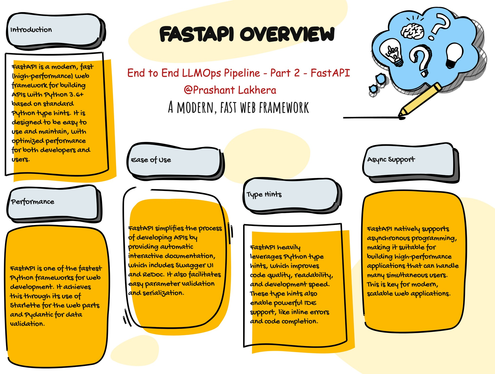

# What is FastAPI?

FastAPI is a modern, fast (high-performance) web framework for building APIs with Python 3.6+ based on standard Python type hints. It is designed to be easy to use and to provide a good developer experience, while also being one of the fastest frameworks available. FastAPI automatically generates interactive API documentation and is built on top of Starlette for the web parts and Pydantic for the data parts.

## Getting Started
Prerequisites
* Python 3.6 or higher
* fastapi library
* uvicorn for running the server
* transformers library by Hugging Face
* pydantic for data validation

## Installation
You need to install the necessary libraries. You can do this using pip:
```bash
pip install fastapi uvicorn transformers pydantic
```
> **Note:** Installing these modules manually via pip is just for demonstration purposes. We are going to create `requirements.txt` and install these modules via GitHub Action.


```bash
# Imports the pipeline function from the Hugging Face transformers library.

from fastapi import FastAPI, HTTPException
from pydantic import BaseModel
from transformers import pipeline
import uvicorn
```

## Importing Necessary Libraries:

* FastAPI and HTTPException from fastapi to build the API and handle exceptions.
* BaseModel from pydantic to define request and response data models.
* pipeline from transformers to initialize the Hugging Face question-answering model.
* uvicorn to run the FastAPI server.

```bash
app = FastAPI()
```

## Creating the FastAPI Application:
app = FastAPI() initializes the FastAPI application.


# Initialize the Hugging Face question-answering pipeline
qa_pipeline = pipeline("question-answering", model="distilbert-base-uncased-distilled-squad")

```bash
# Initialize the Hugging Face question-answering pipeline
qa_pipeline = pipeline("question-answering", model="distilbert-base-uncased-distilled-squad")
```


# Initializing the Question-Answering Pipeline:

The qa_pipeline is created using the "distilbert-base-uncased-distilled-squad" model from Hugging Face's model hub. This pipeline will handle the question-answering task.

> **Note:** For a more detailed explanation on this topic, please check the [Hugging Face](https://github.com/100daysofdevops/end-to-end-llmops-pipeline/blob/main/01-Hugging-Face.md)


```bash
class ChatRequest(BaseModel):
    question: str
    context: str

class ChatResponse(BaseModel):
    answer: str
```

## Defining Data Models:

* ChatRequest and ChatResponse are Pydantic models that define the structure of the request and response data, respectively.
* ChatRequest expects two fields: question (the question to be answered) and context (the context in which to search for the answer).
* ChatResponse contains a single field: answer, which holds the answer found by the model.


```bash
@app.post("/chat", response_model=ChatResponse)
async def chat(request: ChatRequest):
    try:
        result = qa_pipeline(question=request.question, context=request.context)
        return ChatResponse(answer=result['answer'])
    except Exception as e:
        raise HTTPException(status_code=500, detail=str(e))
```

## Creating the /chat Endpoint:

* The @app.post("/chat") decorator defines an endpoint that accepts POST requests at /chat.
* The chat function takes a ChatRequest object as input and uses the qa_pipeline to find the answer based on the question and context.
* If the process is successful, the function returns a ChatResponse object containing the answer.
* If an error occurs, an HTTP 500 error is raised with the exception message.

```bash
if __name__ == "__main__":
    uvicorn.run(app, host="0.0.0.0", port=8000)
```

## Running the Server:

* The if __name__ == "__main__": block ensures that the FastAPI app is only run when the script is executed directly. It starts the server using uvicorn.run() on `host="0.0.0.0"` and `port=8000`
