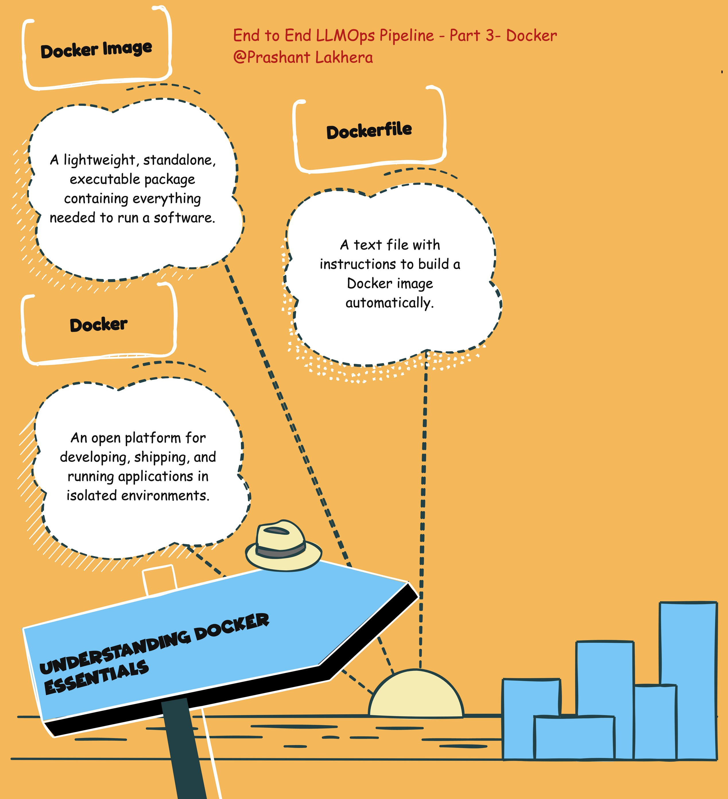

# What is Docker?

Docker is a platform that allows developers to automate the deployment of applications inside lightweight, portable containers. These containers include everything needed to run an application, including the code, runtime, libraries, and system tools. By using Docker, you can ensure that your application behaves the same, regardless of where it is deployed.

## What is a Docker Image?

A Docker image is a lightweight, standalone, executable package that includes everything needed to run a piece of software. It contains the application code, runtime, libraries, environment variables, and configuration files. Images are built from a Dockerfile and can be stored in Docker Hub or other container registries.

## What is a Dockerfile?

A Dockerfile is a script composed of various instructions (commands) that are executed sequentially to build a Docker image. It defines what goes into your Docker image, such as the base image to use, environment variables, files to include, and commands to run.

## Creating the Docker Image

### Prerequisites

- Docker installed on your local machine
- A `main.py` file created in Part 2, which is the FastAPI application we developed earlier
- A `requirements.txt` file listing the dependencies

### Dockerfile

Here's the Dockerfile we'll use to build the Docker image for our FastAPI application:

```Dockerfile
# Use the official Python image from the Docker Hub
FROM python:3.10-slim

# Set the working directory in the container
WORKDIR /app

# Copy only the requirements file to leverage Docker cache
COPY requirements.txt .

# Install the dependencies
RUN pip install --no-cache-dir -r requirements.txt

# Copy the rest of the application code to the working directory
COPY . .

# Expose port 8000
EXPOSE 8000

# Use a minimal entrypoint and CMD
ENTRYPOINT ["python"]
CMD ["main.py"]
```

## Dockerfile Explanation
* Base Image:`FROM python:3.10-slim`: This line specifies the base image to use. Here, we are using the official slim version of Python 3.10. The slim version is a smaller image that contains only the minimal packages needed to run Python, making it more lightweight.
* Working Directory: `WORKDIR /app`: This command sets the working directory inside the container to /app. All subsequent commands in the Dockerfile will be executed within this directory.
* Copying Dependencies: `COPY requirements.txt .`: This command copies the requirements.txt file from your local machine to the container's working directory. This step allows Docker to cache the installed dependencies, speeding up subsequent builds if the dependencies haven't changed.
* Installing Dependencies:`RUN pip install --no-cache-dir -r requirements.txt`: This command installs the Python dependencies listed in the requirements.txt file. The --no-cache-dir option ensures that pip doesn't store any installation files, keeping the Docker image size smaller.
* Copying Application Code: `COPY . .`: This command copies the rest of your application's code into the container's working directory. This includes the main.py file and any other necessary files.
* Exposing Port:`EXPOSE 8000`: This command documents that the container listens on port 8000 at runtime. It does not actually publish the port to the host machine. To make the application accessible from outside the container, you need to map the port using the `-p` option when you run the container.
* Entrypoint and CMD: `ENTRYPOINT ["python"]`: This sets the entrypoint for the container to the python command, meaning the container will execute Python when it starts. `CMD ["main.py"]`: This command specifies the default Python script to run. In this case, it's main.py, which is the FastAPI application.

## Building and Running the Docker Image
### Building the Docker Image:

* To build the Docker image, use the following command:
bash 
```
docker build -t fastapi-app .
```
This command tells Docker to build the image from the Dockerfile in the current directory and tag it as fastapi-app.
Running the Docker Container:

Once the image is built, you can run the container using:

```
docker run -p 8000:8000 fastapi-app
```
This command runs the container, mapping port 8000 of the container to port 8000 on your host machine. You can now access the FastAPI application at 

http://localhost:8000

> **Note:** This is only for illustration purposes. We are going to use Kubernetes to run the Docker container.

[← Previous](day2.html) | [Next →](day4.html)

