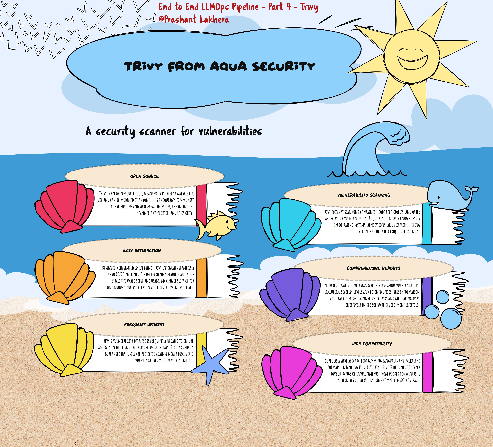

# What is Trivy?

Trivy is a comprehensive, easy-to-use vulnerability scanner for containers. It detects vulnerabilities in operating system packages (Alpine, RHEL, CentOS, etc.) and application dependencies (Bundler, Composer, npm, yarn, etc.). Trivy is designed to be simple and fast, with a high level of accuracy, and it supports scanning both Docker images and filesystem directories.

## Installing Trivy

Trivy can be easily installed on any system that supports Docker. Below are the steps to install Trivy:

### Prerequisites

- Docker installed on your local machine

### Installation

You can install Trivy using the following command:

```bash
curl -sfL https://raw.githubusercontent.com/aquasecurity/trivy/main/contrib/install.sh | sudo sh -s -- -b /usr/local/bin
```

This command downloads and installs Trivy on your local machine, placing the executable in /usr/local/bin.

Alternatively, you can use the Docker container method:

```
docker pull aquasec/trivy:latest
```

## Scanning a Docker Image

Once Trivy is installed, you can use it to scan a Docker image for vulnerabilities.

```
trivy image --severity HIGH,CRITICAL <image name>
```

This command will scan the image and report only the vulnerabilities with HIGH and CRITICAL severities.

## Interpreting the Scan Results
Trivy will output a list of vulnerabilities found in the Docker image, categorized by severity (LOW, MEDIUM, HIGH, CRITICAL). Each entry in the report includes:

* Vulnerability ID: The unique identifier of the vulnerability.
* Package Name: The affected package or dependency.
* Installed Version: The version of the package that is currently installed in the image.
* Fixed Version: The version of the package in which the vulnerability has been fixed.
* Severity: The level of threat the vulnerability poses (e.g., LOW, MEDIUM, HIGH, CRITICAL).

## Example Output
Here's an example of what the output might look like:

```
fastapi-app (alpine 3.13.5)
============================
Total: 3 (UNKNOWN: 0, LOW: 1, MEDIUM: 1, HIGH: 1, CRITICAL: 0)

+---------------+------------------+----------+-------------------+---------------+--------------------------------+
| VULNERABILITY | PACKAGE          | SEVERITY | INSTALLED VERSION | FIXED VERSION | DESCRIPTION                    |
+---------------+------------------+----------+-------------------+---------------+--------------------------------+
| CVE-2021-1234 | alpine-foo       | HIGH     | 1.2.3             | 1.2.4         | Description of the vulnerability|
+---------------+------------------+----------+-------------------+---------------+--------------------------------+
| CVE-2021-5678 | alpine-bar       | MEDIUM   | 4.5.6             | 4.5.7         | Description of the vulnerability|
+---------------+------------------+----------+-------------------+---------------+--------------------------------+
| CVE-2021-9101 | alpine-baz       | LOW      | 7.8.9             | 7.8.10        | Description of the vulnerability|
+---------------+------------------+----------+-------------------+---------------+--------------------------------+

```

> **Note:** The example is for illustration purposes, and the focus will be on integrating Trivy with GitHub Actions to identify vulnerabilities before deployment.

[← Previous](day3.html) | [Next →](day5.html)

