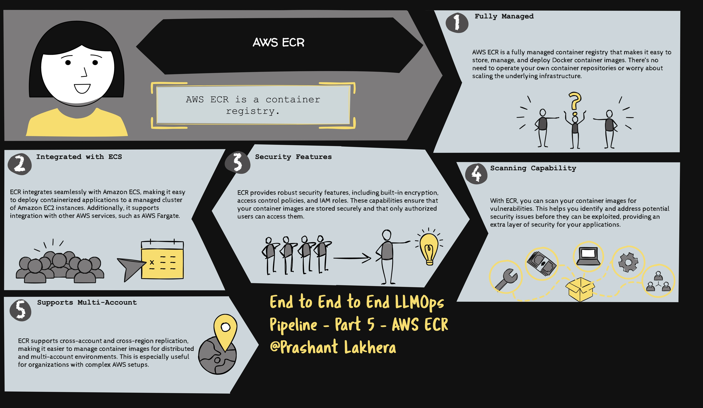

# What is AWS Elastic Container Registry (ECR)?

AWS Elastic Container Registry (ECR) is a fully managed Docker container registry that makes it easy for developers to store, manage, and deploy container images. ECR is integrated with AWS Identity and Access Management (IAM), so you can control who can access your container images.

## Prerequisites

Before you can push Docker images to AWS ECR, you need the following:

- AWS CLI installed and configured on your local machine.
- Docker installed and running on your local machine.
- An AWS account with appropriate permissions to create and push images to ECR.

## Configuring AWS ECR

To start using AWS ECR, you need to create a repository where your Docker images will be stored.

### Step 1: Create an ECR Repository

You can create an ECR repository using the AWS Management Console, AWS CLI, or an SDK. Here’s how to create one using the AWS CLI:

```bash
aws ecr create-repository --repository-name my-repo --region $AWS_REGION
```

Replace `my-repo` with your desired repository name and `$AWS_REGION` with the region where you want to create the repository.

## Authenticate Docker with ECR
Before you can push Docker images to ECR, you need to authenticate Docker with your ECR registry. This is done using the AWS CLI.

```
aws ecr get-login-password --region $AWS_REGION | docker login --username AWS --password-stdin ${{ secrets.AWS_ACCOUNT_ID }}.dkr.ecr.$AWS_REGION.amazonaws.com
```

This command retrieves an authentication token using the AWS CLI. The token is required for Docker to authenticate with the AWS ECR registry.
This command logs in to the ECR registry using the retrieved authentication token. The `--password-stdin` option allows you to pass the password securely from the AWS CLI command via stdin.

# Tag and Push Docker Image to ECR

Once Docker is authenticated with ECR, you can tag your Docker image and push it to your ECR repository.

```bash
docker push ${{ secrets.AWS_ACCOUNT_ID }}.dkr.ecr.$AWS_REGION.amazonaws.com/$ECR_REPOSITORY:$GITHUB_SHA
```

> **Note:** This is only for illustration purposes. We are going to integrate ECR with GitHub Actions to ensure that Docker images are automatically built and pushed to ECR as part of your CI/CD pipeline.

[← Previous](04-Trivy) | [Next →](06-Kubernetes)
