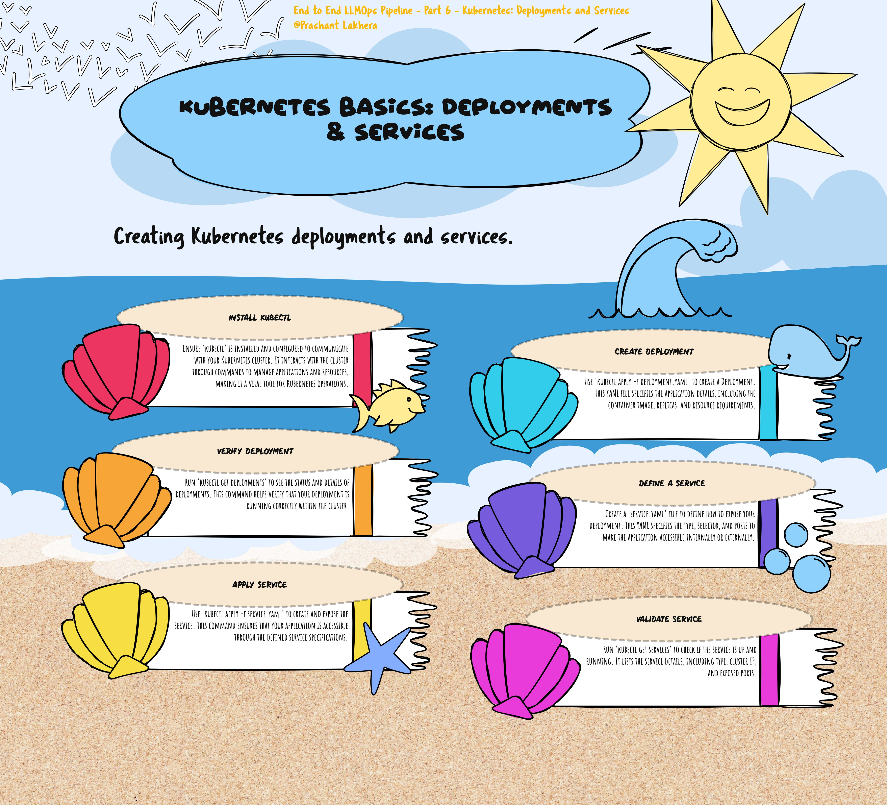

# Kubernetes: Deployments and Services

Kubernetes is an open-source platform designed to automate deploying, scaling, and operating application containers. It allows developers to manage containerized applications across a cluster of machines, providing essential features like scaling, load balancing, and automated rollouts and rollbacks.

## Kubernetes Deployments

A **Deployment** in Kubernetes is a resource object that provides declarative updates to applications. You define the desired state of the application in a YAML file, and the Deployment controller makes the changes to the application’s current state to match the desired state. Deployments are used to create and manage a set of identical pods (containers running an application), ensuring that the specified number of replicas is always running.

### Key Features of Deployments:
- **Replica Management**: Ensures that a specified number of replicas of a pod are running at all times.
- **Rolling Updates**: Gradually replaces old versions of pods with new ones, ensuring zero downtime.
- **Rollback**: If something goes wrong, you can roll back to a previous version of the deployment.

## Kubernetes Services

A **Service** in Kubernetes is an abstract way to expose an application running on a set of Pods as a network service. With Kubernetes, you don't need to modify your application to use an unfamiliar service discovery mechanism. Kubernetes gives Pods their own IP addresses and a single DNS name for a set of Pods, and can load-balance across them.

### Types of Services:
- **ClusterIP**: Exposes the service on a cluster-internal IP. This is the default ServiceType.
- **NodePort**: Exposes the service on each Node’s IP at a static port (the NodePort). A ClusterIP service, to which the NodePort service routes, is automatically created.
- **LoadBalancer**: Exposes the service externally using a cloud provider’s load balancer.
- **ExternalName**: Maps a Service to a DNS name.

## YAML File Explanation

The provided YAML file defines a Kubernetes Deployment and a Service.

### Deployment YAML

```yaml
apiVersion: apps/v1
kind: Deployment
metadata:
  name: gpt-huggingface
spec:
  replicas: 3
  selector:
    matchLabels:
      app: gpt-hf-pod
  template:
    metadata:
      labels:
        app: gpt-hf-pod
    spec:
      containers:
      - name: gptcontainer
        image: image_name
        ports:
        - containerPort: 8000
```

- **apiVersion: apps/v1**: Specifies the API version of the Kubernetes resource. For Deployments, it's `apps/v1`.
- **kind: Deployment**: Defines the type of Kubernetes resource being created.
- **metadata**:
  - **name: gpt-huggingface**: The name of the Deployment.
- **spec**:
  - **replicas: 3**: Specifies that three replicas (instances) of the pod should be running.
  - **selector**:
    - **matchLabels**:
      - **app: gpt-hf-pod**: This label is used to identify the pods managed by this Deployment.
  - **template**: Describes the pod to be created.
    - **metadata**:
      - **labels**:
        - **app: gpt-hf-pod**: Labels that the pod will carry. These must match the `selector` to ensure the Deployment manages these pods.
    - **spec**:
      - **containers**: Defines the container specifications.
        - **name: gptcontainer**: The name of the container.
        - **image: image_name**: The Docker image to use for this container. Replace `image_name` with the actual image name.
        - **ports**:
          - **containerPort: 8000**: The port on which the container will listen.

```yaml
apiVersion: v1
kind: Service
metadata:
  name: gpt-hf-service
spec:
  type: NodePort
  selector:
    app: gpt-hf-pod
  ports:
  - port: 8000 
    targetPort: 8000
    nodePort: 30007
```

### Deploying the `deploy.yaml` File to Kubernetes

To deploy the `deploy.yaml` file to your Kubernetes cluster, follow these steps:

To deploy the deployment.yaml file, use the kubectl apply command:

```
kubectl apply -f deployment.yaml
```

This command will create the resources defined in the deploy.yaml file, such as the Deployment and Service.


### Verify the Deployment

You can verify that your deployment was successful by checking the status of the deployment and services:

```
kubectl get deploy
kubectl get services
```

These commands will display the running deployments and services, confirming that your application is deployed and accessible.

> **Note:** This is for illustration purposes. We are going to deploy this configuration using GitHub Actions, which will automate the deployment process as part of your CI/CD pipeline.

[← Previous](day5.html) | [Next →](day7.html)

