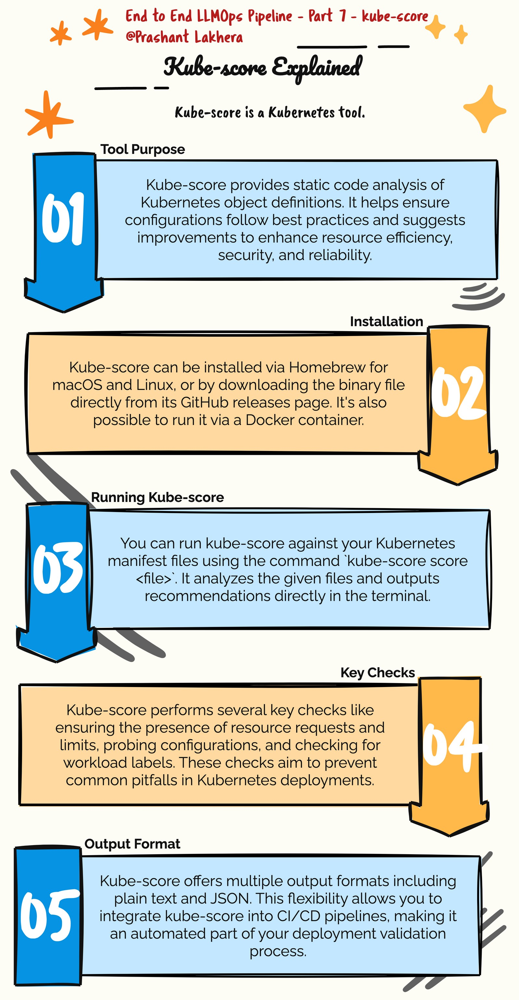

# Using `kube-score` to Validate Kubernetes Manifests

`kube-score` is a tool that helps you validate and improve the quality of your Kubernetes manifests. It performs a static analysis of your manifests and provides recommendations for improvements. This tool is particularly useful in CI/CD pipelines to ensure that your Kubernetes configurations follow best practices.

## Installing `kube-score`

You can install `kube-score` by following the instructions on the [kube-score GitHub repository](https://github.com/zegl/kube-score). Alternatively, you can use `brew` on macOS:

```bash
brew install kube-score
```

### Validating Your Kubernetes Manifests with `kube-score`

To validate your Kubernetes manifests, you can use the `kube-score score` command. This command analyzes your YAML files and provides a score based on various checks, such as pod security, container resource limits, and other best practices.

```bash
kube-score score --output-format ci deploy.yaml
```

* kube-score score: This command runs kube-score to analyze the specified Kubernetes YAML file (deploy.yaml in this case).
* --output-format ci: This option formats the output in a way that is suitable for continuous integration (CI) systems. The output will be concise and in a format that can be easily parsed by CI tools.
* deploy.yaml: The file being analyzed by kube-score. Replace this with the path to your actual Kubernetes manifest file if different.

### Output

The command will output a list of checks performed on the manifest, along with any warnings or recommendations for improvement. For example:

```
[WARNING] Container Resources
   · gptcontainer -> No resource limits set for container
   Resource limits are recommended to avoid resource contention issues in the cluster.
   Set resource limits using 'resources.limits.cpu' and 'resources.limits.memory'.

[OK] Pod Probes
   · gptcontainer -> Liveness probe is configured
   · gptcontainer -> Readiness probe is configured
```
