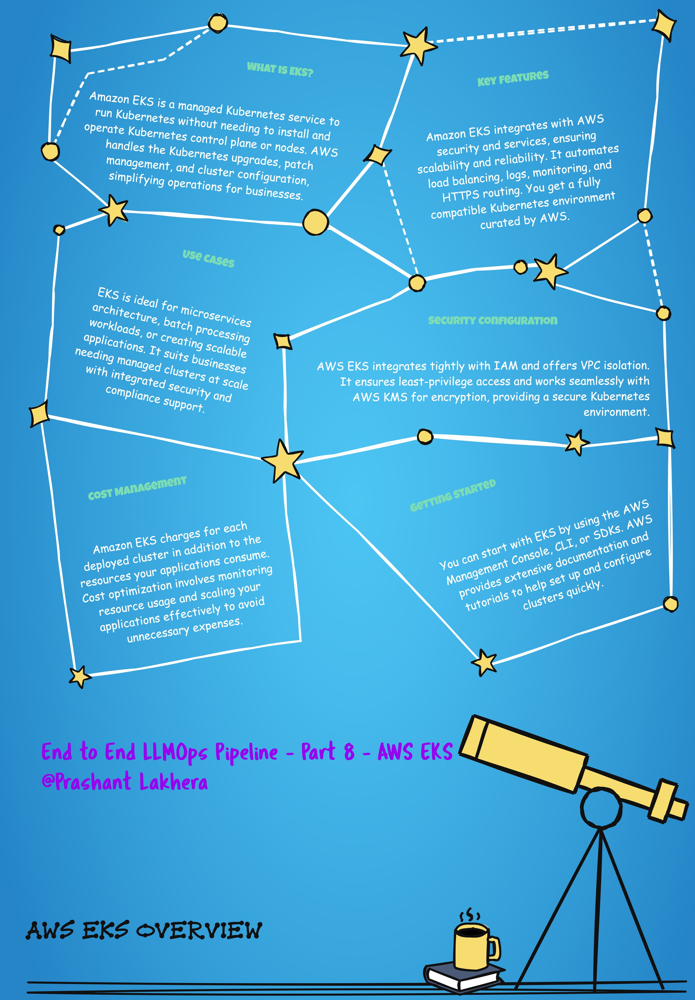

# Deploying and Managing Kubernetes Clusters with AWS EKS

AWS Elastic Kubernetes Service (EKS) is a fully managed Kubernetes service that simplifies the process of running Kubernetes on AWS. EKS provides highly available and secure clusters that are integrated with AWS services, making it easier to manage Kubernetes deployments in the cloud.

#### Setting Up an EKS Cluster

To set up an EKS cluster, you typically follow these steps:

1. **Create an EKS Cluster**: Use the AWS Management Console, AWS CLI, or AWS CloudFormation to create an EKS cluster.
2. **Configure `kubectl`**: Ensure that `kubectl` is configured to interact with your EKS cluster.
3. **Deploy Kubernetes Resources**: Use `kubectl` to deploy your Kubernetes resources to the EKS cluster.

#### Example Command to Configure `kubectl`

Once your EKS cluster is set up, you need to configure `kubectl` to connect to it:

```bash
aws eks update-kubeconfig --region $AWS_REGION --name $EKS_CLUSTER_NAME
```

### Command Explanation

- **`aws eks update-kubeconfig`**: This command updates your local `kubeconfig` file with the necessary configuration to connect to your EKS cluster.
- **`--region $AWS_REGION`**: Specifies the AWS region where your EKS cluster is running.
- **`--name $EKS_CLUSTER_NAME`**: The name of the EKS cluster you want to connect to. Replace `$EKS_CLUSTER_NAME` with the actual name of your cluster

[← Previous](07-kube-score) | [Next →](09-kustomize)
