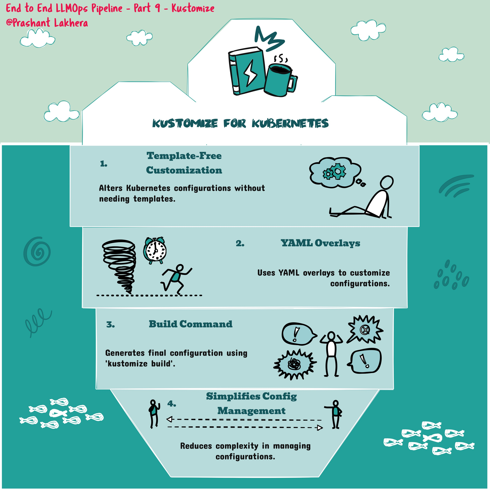

# Working with `kustomize` to Manage Kubernetes Manifests

`kustomize` is a tool that lets you customize Kubernetes resource definitions without modifying the original YAML files. It works by layering configurations on top of base resources, making it easier to manage different environments (e.g., development, staging, production) with a single set of YAML files.

#### Example Commands

1. **Generate a Kustomization File**
  ```
   kustomize create --autodetect
  ```

kustomize create --autodetect: This command generates a kustomization.yaml file by automatically detecting the Kubernetes resource files in the current directory. This file will define the resources, patches, and other customizations that kustomize will manage.

2. **Build Kubernetes Manifests**
```
kustomize build .
```
kustomize build .: This command builds the final Kubernetes manifests by applying the customizations defined in the kustomization.yaml file to the base resources. The output is a fully rendered set of YAML files that can be applied to your Kubernetes cluster.

3. **Apply the Built Manifests to a Kubernetes Cluster**
```
kubectl apply -k .
```

kubectl apply -k .: This command applies the customized resources directly to your Kubernetes cluster. The -k flag tells kubectl to use kustomize to build the manifests before applying them.

**Set a New Image in Your Kustomization**

```
   kustomize edit set image image_name=${{ secrets.AWS_ACCOUNT_ID }}.dkr.ecr.$AWS_REGION.amazonaws.com/$ECR_REPOSITORY:$GITHUB_SHA 
```

This command updates the kustomization.yaml file to set a new image for your Kubernetes deployment. The image name is set dynamically using environment variables or secrets provided in a CI/CD pipeline (e.g., GitHub Actions). Here, image_name is replaced with the Docker image hosted in AWS ECR, tagged with the commit SHA ($GITHUB_SHA) for traceability.
