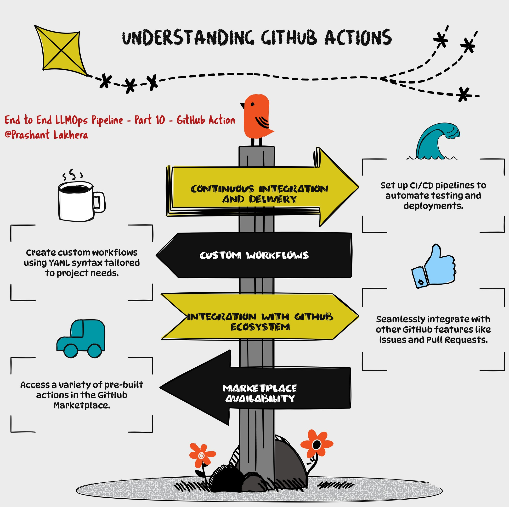

# GitHub Actions

This GitHub Actions workflow automates the process of building, scanning, publishing a Docker image to Amazon ECR, and deploying it to an Amazon EKS cluster. 

## Workflow Overview

- **Name**: CI/CD Pipeline for EKS Deployment
- **Triggers**: 
  - Runs on push events to the `main` branch.
  - Runs on pull requests targeting the `main` branch.

## Environment Variables

The `env` section defines environment variables that are used throughout the workflow:

- **AWS_REGION**: AWS region where the ECR repository and EKS cluster are located.
- **ECR_REPOSITORY**: Name of the ECR repository.
- **EKS_CLUSTER_NAME**: Name of the EKS cluster.
- **DEPLOYMENT_NAME**: Name of the Kubernetes deployment.
- **IMAGE**: Name of the Docker image.

## Job: Build, Scan, Publish, and Deploy

This job runs on an `ubuntu-latest` runner and is responsible for the entire CI/CD process. It runs in the `production` environment.

### Steps

1. **Checkout the Code**

    ```yaml
    - name: Checkout
      uses: actions/checkout@v2
    ```

    - This step checks out the repository's code, making it available for subsequent steps.

2. **Configure AWS Credentials**

    ```yaml
    - name: Configure AWS credentials
      uses: aws-actions/configure-aws-credentials@v1
      with:
        aws-access-key-id: ${{ secrets.AWS_ACCESS_KEY_ID }}
        aws-secret-access-key: ${{ secrets.AWS_SECRET_ACCESS_KEY }}
        aws-region: ${{ env.AWS_REGION }}
    ```

    - This step configures the AWS credentials required to interact with AWS services like ECR and EKS.

3. **Login to Amazon ECR**

    ```yaml
    - name: Login to Amazon ECR
      id: login-ecr
      run: |
        aws ecr get-login-password --region $AWS_REGION | docker login --username AWS --password-stdin ${{ secrets.AWS_ACCOUNT_ID }}.dkr.ecr.$AWS_REGION.amazonaws.com
    ```

    - This step logs in to the Amazon ECR registry using AWS CLI. The login credentials are passed securely using the `--password-stdin` option.

4. **Build Docker Image**

    ```yaml
    - name: Build Docker image
      run: |
        docker build -t $ECR_REPOSITORY:$GITHUB_SHA .
        docker tag $ECR_REPOSITORY:$GITHUB_SHA ${{ secrets.AWS_ACCOUNT_ID }}.dkr.ecr.$AWS_REGION.amazonaws.com/$ECR_REPOSITORY:$GITHUB_SHA
    ```

    - This step builds a Docker image from the checked-out code and tags it with the GitHub SHA for traceability.

5. **Install Trivy**

    ```yaml
    - name: Install Trivy
      run: |
        curl -sfL https://raw.githubusercontent.com/aquasecurity/trivy/main/contrib/install.sh | sudo sh -s -- -b /usr/local/bin
    ```

    - This step installs Trivy, a security scanner for Docker images.

6. **Clean Up Disk Space**

    ```yaml
    - name: Clean up disk space
      run: |
        sudo rm -rf /var/lib/apt/lists/*
        sudo apt-get clean
    ```

    - This step cleans up disk space to ensure that the runner has enough free space for subsequent operations.

7. **Scan Docker Image with Trivy**

    ```yaml
    - name: Scan Docker image with Trivy
      run: |
        trivy image --severity HIGH,CRITICAL $ECR_REPOSITORY:$GITHUB_SHA
    ```

    - This step scans the Docker image for vulnerabilities with high and critical severity using Trivy.

8. **Push Docker Image to Amazon ECR**

    ```yaml
    - name: Push Docker image to Amazon ECR
      run: |
        docker push ${{ secrets.AWS_ACCOUNT_ID }}.dkr.ecr.$AWS_REGION.amazonaws.com/$ECR_REPOSITORY:$GITHUB_SHA
    ```

    - This step pushes the Docker image to the Amazon ECR repository.

9. **Setup kubectl**

    ```yaml
    - name: Setup kubectl
      run: |
        curl -o kubectl https://amazon-eks.s3.us-west-2.amazonaws.com/1.21.13/2022-06-08/bin/linux/amd64/kubectl
        chmod +x ./kubectl
        mkdir -p $HOME/bin && cp ./kubectl $HOME/bin/kubectl && export PATH=$HOME/bin:$PATH
        echo 'export PATH=$HOME/bin:$PATH' >> ~/.bashrc
    ```

    - This step installs `kubectl`, the Kubernetes command-line tool, and configures the system path to include it.

10. **Set up Kustomize**

    ```yaml
    - name: Set up Kustomize
      run: |
        curl -s "https://raw.githubusercontent.com/kubernetes-sigs/kustomize/master/hack/install_kustomize.sh"  | bash
        chmod u+x kustomize
        sudo mv kustomize /usr/local/bin/kustomize
    ```

    - This step installs Kustomize, a tool for customizing Kubernetes YAML configurations.

11. **Update kubeconfig**

    ```yaml
    - name: Update kubeconfig
      run: |
        aws eks update-kubeconfig --name $EKS_CLUSTER_NAME --region $AWS_REGION
    ```

    - This step updates the kubeconfig file to allow `kubectl` to interact with the EKS cluster.

12. **Install kube-score**

    ```yaml
    - name: Install kube-score
      run: |
        curl -L -o kube-score https://github.com/zegl/kube-score/releases/download/v1.11.0/kube-score_1.11.0_linux_amd64
        chmod +x kube-score
        sudo mv kube-score /usr/local/bin/
    ```

    - This step installs kube-score, a tool that validates Kubernetes manifests for best practices.

13. **Lint Kubernetes Manifests with kube-score**

    ```yaml
    - name: Lint Kubernetes manifests with kube-score
      continue-on-error: true
      run: |
        kube-score score --output-format ci deploy.yaml
    ```

    - This step lints the Kubernetes manifests using kube-score. The `continue-on-error` flag allows the workflow to proceed even if this step fails.

14. **Deploy with Kustomize**

    ```yaml
    - name: Deploy with Kustomize
      run: |
        kustomize edit set image image_name=${{ secrets.AWS_ACCOUNT_ID }}.dkr.ecr.$AWS_REGION.amazonaws.com/$ECR_REPOSITORY:$GITHUB_SHA
        kustomize build . | kubectl apply -f -
        kubectl rollout status deployment/$DEPLOYMENT_NAME
        kubectl get services -o wide
    ```

    -This step uses Kustomize to update the image in the Kubernetes manifests, builds the final manifests, and deploys them to the EKS cluster. It also checks the status of the deployment and lists the services.

[← Previous](09-kustomize)
