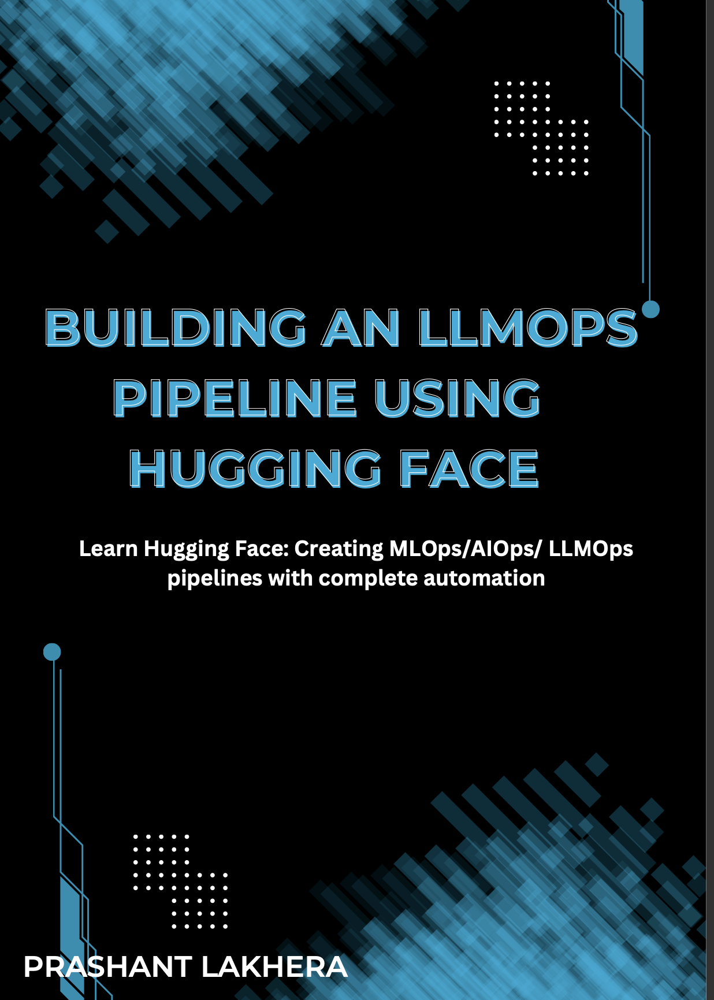
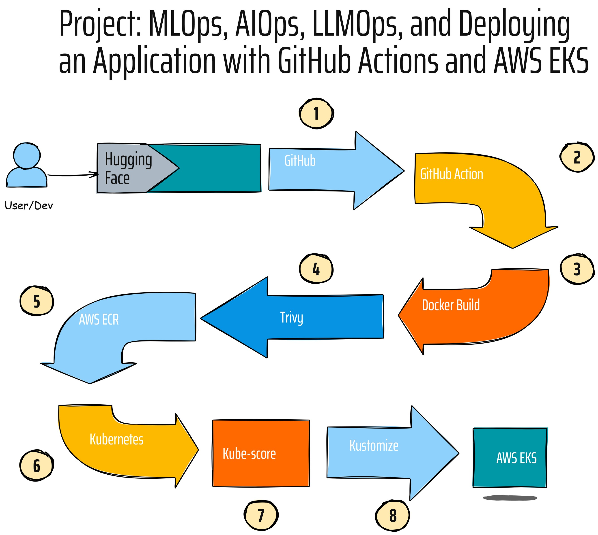

# End-to-End LLMOps Project from Scratch Using Hugging Face, FastAPI, Docker, Trivy, AWS Elastic Container Registry (ECR), Kubernetes, Kube-score, AWS Elastic Kubernetes Service (EKS), Kustomize, and GitHub Actions

## About This Project

This project is an excerpt from my book. For a more detailed explanation and in-depth coverage of the topics, please check out the book [here](https://pratimuniyal.gumroad.com/l/BuildinganLLMOpsPipelineUsingHuggingFace). 

## Project Overview

This repository provides a step-by-step guide to building an LLM (Large Language Model) pipeline from scratch. Below is an overview of what the pipeline looks like:

- [Day 1: Hugging Face](./01-Hugging-Face.md)
- [Day 2: FastAPI](./02-FastAPI.md)
- [Day 3: Docker](./03-Docker.md)
- [Day 4: Trivy](./04-Trivy.md)
- [Day 5: AWS ECR](./05-AWS-ECR.md)
- [Day 6: Kubernetes](./06-Kubernetes.md)
- [Day 7: kube-score](./07-kube-score.md)
- [Day 8: AWS EKS](./08-EKS.md)
- [Day 9: kustomize](./09-kustomize.md)
- [Day 10: GitHub Actions](./10-github-action.md)
